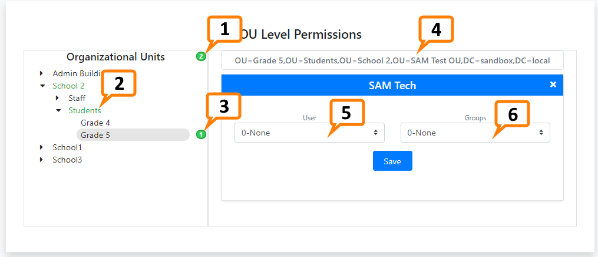

# Permissions
## Privilge Levels
Privilege Levels are essentially Active Directory groups that are allowed to log into the application.

By being in one of the groups assigned a Privilege Level, a user can sign into the application.
!!! danger "Super User Warning"
    Setting a group as super user is only advisable for IT staff.
    
    If you want to give a group full access to all users and groups,
    use district level permissions instead.

!!! question "Changing Groups"
    If a group name changes, or you want to move a set of permissions to another group, you can simply rename the Privilege
    Level group name.
!!! danger "Deleting Privilege Levels"
    At the current state deleting a Privilege Level removes all mapped permissions and permanently deletes the Privilege Level.
    In a future update this will be improved to allow recovery. 
## Permission Levels
Each permission defined has options for User and Group permission levels. These levels define the access type the user should have at that respective OU branch.
There are currently five levels each with the follow effects.

### User
- **None**
    - Cannot read user information
    - Cannot add users to groups even with associated group permission
- **Read**
    - Can read user information
    - Can add user to groups with associated group permission
- **Change**
    - Can reset user passwords
- **Unlock**
    - Can unlock users
- **Disable**
    - Can enable and disable users
    
    !!! danger "Disable"
            For obvious reasons, be extremely careful about both who you give this permission and where in your OU structure it is applied.
    
### Group
- **None**
    - Cannot read group information
    - Cannot add users to groups even with associated user permission
- **Read**
    - Can read group information
    - Can add group to groups with associated group permission
- **Change**
    - Can add users to group
- **Add**
    - Can create new groups
- **Delete**
    - Can delete entire groups
    
    !!! danger "Delete"
        For obvious reasons, be extremely careful about both who you give this permission and where in your OU structure it is applied.

## OU Permission Navigator

1. Total number of OU level permissions applied for entire application
1. An OU highlighted green indicates that a sub-OU has permissions applied beneath it.
1. Number of permissions applied to this particular OU
1. The distinguished name of the OU for the currently displayed permissions
1. The user permission level this Privilege Level has for this OU.
1. The group permission level this Privilege Level has for this OU.

!!! note
    User and group permissions apply at the current OU and all child OU's unless explicitly set lower.
    
!!! question "Blocking Inheritance"
    To stop inheritance at a certain OU level, add a permission with "None" set.